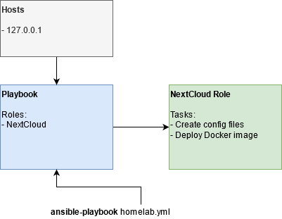
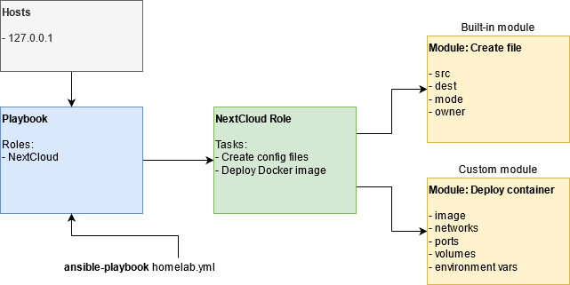
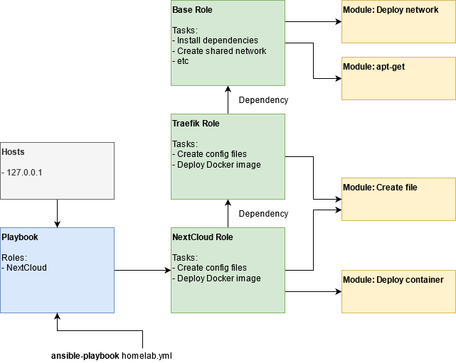
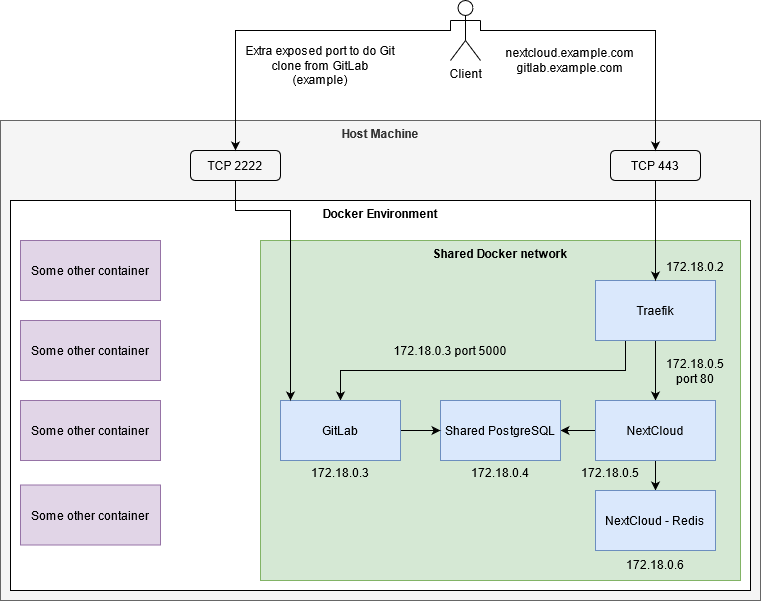
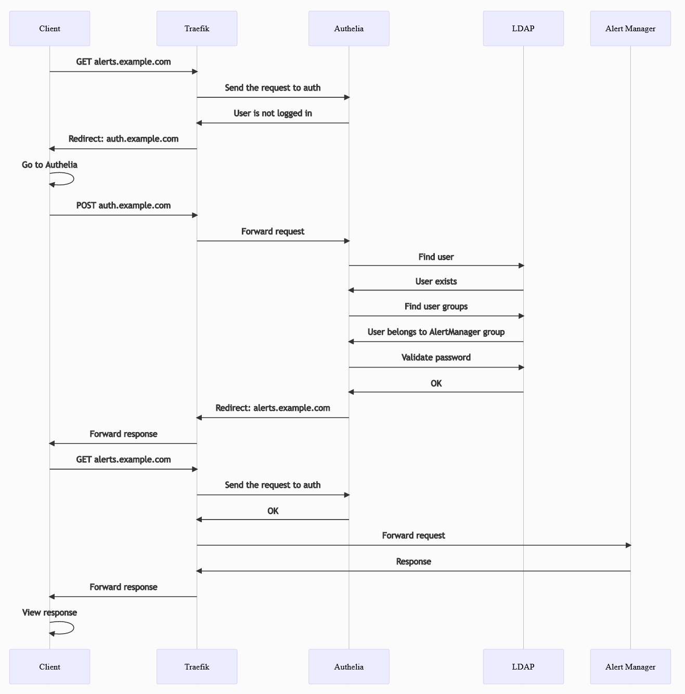

# Homelab: How it works?

## Ansible

Ansible is a provisioning software tool that provides configuration management and application deployment. Normally you would use it to install software on a target machine(s), but we are not doing that exactly in here. Instead, we use it to deploy Docker containers. It acts sort of as a docker-compose tool but with additional logic.

First, the Ansible takes a playbook, which defines some roles that should be applied on the remote. Each role contains serveral tasks that make sure that the application has been deployed. The list of hosts in our case is a localhost. You are meant to run this project within your server. However, you can modify the `hosts` file in the root project directory with a remote target.

Each task runs a specific module. This module can be built-in (included in Ansible) or a custom module written in Python. For example, to deploy NextCloud application, we need to create folder structure, create some configuration files, and then deploy Docker container (in some cases, multiple Docker containers per app).

Each task (with a module) can pass or skip. This depends on the conditions of the host and the user provided variables (located in `group_vars` folder). Each role has its own logic to determine what needs to be done.

However, to deploy NextCloud, we need some kind of reverse proxy, that will listen on HTTPS port of 443 (optionally HTTP 80) and will forward the required traffic into the correct Docker container, in our case the NextCloud container. So that when you type `curl -v -k https://localhost:443 -H 'Host: nextcloud.example.com'` it will go to NextCloud.

We will need to deploy Traefik, a simple reverse proxy, that does most of its configuration automatically, and works perfectly with Docker. We define Traefik deployment in a separate role, as this role may be needed in some other applications. For NextCloud, you will also need PostgreSQL (not pictured). However, all of those dependencies will need some shared network, and possibly some host required dependencies. The "Base" role ensures that all of the common things have been met.

## Docker

When you deploy your apps, the following architecture below will be created (no all apps pictured). Ansible will create a single Docker network that is shared among all apps. This network is freshly created and Ansible will not use any of your existing Docker networks. The apps are deployed into the Docker environment and only connected to this network. Additionally, the Traefik will have two HTTP and HTTPS ports exposed to your host. You can change the port numbers in the `group_vars/homelab/traefik.yml` file. These ports will be used by your clients to access the apps.

All apps will have a label of `com.docker.compose.project=<value>` with value you have chosen by specifying the `project_name` in `group_vars/homelab/base.yml` file. This is to identify that all of these apps form a single project. This is the same way Docker Compose (also recognized by Portainer) is using this variable to identify containers in a single project. Traefik will only be able to recognize containers that are using this label=value pair.

This way, for example, your user will not be able to access PostgreSQL unless you manually expose the port.

Additionally, some of your containers (if you choose doing so) can expose additional ports to the host to be used by your clients. For example, it may be beneficial for GitLab to expose port 22 as 2222 so that you can git clone & push by using SSL instead of HTTPS clone URL.

## Authentication

Each app can have it's own authentication method (for example, File Browser). Some apps don't have any (for example, Traefik's dashboard or Alert Manager). And finally, some apps support LDAP authentication (for example, NextCloud).

This project's main focus is to unify all of this into a single authentication provider, a LDAP server. So that all apps will use this central system to verify whether a user exists, has the correct password, and has the permission to access the app.

A small problem arrives when it is not possible for an app to be connected to a LDAP server, and a the internal authentication method can not be disabled. This affects File Browser and Miniflux apps. **We can not do anything about it** and only ask apps' developers to implement this feature.

**When an app provides no authentication method**, this project offers an optional LDAP authentication that uses a [forward auth](https://doc.traefik.io/traefik/middlewares/forwardauth/), which is part of Traefik. This redirects user to an authentication app, in our case Authelia, that uses LDAP to perform user's authentication.

The following is a sequence diagram when user tries to go to Alert Manager's page (alerts.example.com) but the user is not logged in.

**When an app has LDAP support**, this will use LDAP natively, no forward auth is required. The user will simply use the existing GUI provided by the application to log in. This works out of the box with Jellyfin, NextCloud, Grafana, GitLab, and many more.

